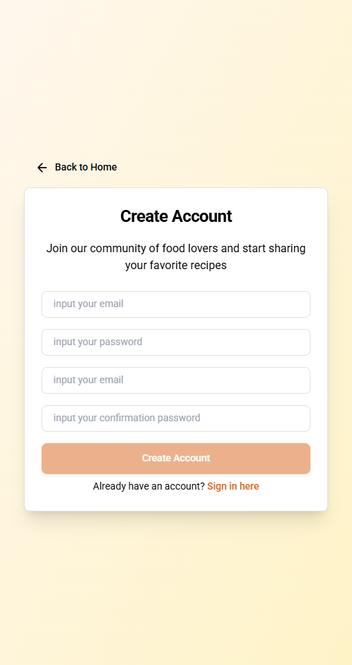

# 🍽️ Flavoriz – Food Blog Web App (Vue Frontend Only)

**Flavoriz** is a static food blog application built with **Vue 3**, **TailwindCSS**, and **Vuetify**. It showcases recipes and culinary articles using a modern user interface, dynamic routing, and scroll-based animations. The app fetches all its data from locally simulated **dummy JSON APIs**, making it ideal for frontend prototyping.

---

## 1. Project Overview

This project was created to simulate a recipe-based food blog using Vue 3 and TailwindCSS. It demonstrates how to build a fully static frontend application with structured content, UI components, and dynamic routing—all without relying on a backend or CMS.

---

## 2. Project Goals

- Present recipes and articles using clean, scroll-friendly UI
- Practice building SPA navigation with slug-based detail pages
- Use TailwindCSS utility-first classes to develop responsive layouts
- Demonstrate layout and routing structures that reflect real-world frontend architecture

---

## 3. Challenges

- Designing reusable card components for articles and recipes
- Mapping static JSON data into dynamic routes using slugs
- Creating a consistent layout using Vuetify + Tailwind without conflict
- Ensuring responsiveness across multiple screen sizes

---

## 4. Approach & Solution

The project was structured around Vue 3 with Vue Router to implement single-page navigation. Recipes and blog articles are stored in static JSON files and rendered using dynamic routes. Vuetify components were combined with Tailwind utility classes to provide both style consistency and layout flexibility. AOS was integrated for scroll animations, while Font Awesome icons enhance UI accessibility.

---

## 5. Main Features

- ✨ **Modern Landing Page** – Highlights featured recipes and culinary topics.
- 📚 **Blog & Recipe Listings** – Includes listing and detail views for blog articles and recipes.
- 🔁 **SPA Navigation** – Seamless routing using `vue-router`.
- 🎞️ **Scroll Animations** – Powered by AOS for smooth entrance effects.
- 🔐 **Login & Register Forms (UI Only)** – Demo forms with basic validation.
- 🔗 **Slug-Based Dynamic Routing** – Clean URLs for blog and recipe detail pages.
- 📱 **Responsive Design** – Tailored for all devices with Tailwind & Vuetify Grid.
- 🧩 **Font Awesome Integration** – Rich iconography for UI enhancement.

---

## 6. Tech Stack

- [Vue 3](https://vuejs.org/)
- [TailwindCSS](https://tailwindcss.com/)
- [Vuetify 3](https://vuetifyjs.com/)
- [Vue Router](https://router.vuejs.org/)
- [AOS (Animate on Scroll)](https://michalsnik.github.io/aos/)
- [Font Awesome Icons](https://fontawesome.com/)
- [Vue Toastification](https://vue-toastification.maronato.dev/)

---

## 7. Page Structure

| Page          | Path            | Description                             |
| ------------- | --------------- | --------------------------------------- |
| Home          | `/`             | Main landing page with featured content |
| Recipes       | `/recipe`       | Lists all recipes                       |
| Recipe Detail | `/recipe/:slug` | Detailed view for each recipe           |
| Blog          | `/blog`         | Lists all blog articles                 |
| Blog Detail   | `/blog/:slug`   | Detailed view for each article          |
| Sign In       | `/signin`       | Demo login page                         |
| Sign Up       | `/signup`       | Demo registration page                  |
| Not Found     | `*`             | 404 fallback page                       |

---

## 8. Getting Started

1. **Clone this repository**

```bash
git clone https://github.com/yourusername/flavoriz-foodblog.git
cd flavoriz-foodblog
```

2. **Install dependencies**

```bash
npm install
```

3. **Run the development server**

```bash
npm run dev
```

4. **Build for production**

```bash
npm run build
```

5. **Preview the build output**

```bash
npm run preview
```

---

## 🧾 Demo Notes

- Blog and recipe data is loaded from local static JSON.
- Login and Register forms are for UI demonstration only.
- AOS provides scroll animations.
- Routing uses clean slugs for content pages.

---

## 👨‍💼 Developer

- Medium: [@foemry](https://medium.com/@foemry)
- Instagram: [@oemryfiqri](https://instagram.com/oemryfiqri)
- Website: [https://ahmadfiqrioemry.com](https://ahmadfiqrioemry.com)
- LinkedIn: [linkedin.com/in/ahmadfiqrioemry](https://linkedin.com/in/ahmadfiqrioemry)

---

## 📄 License

This project is licensed under the MIT License – feel free to use and modify.

---

## 📸 Preview Screenshots

<p align="center">
  
  
</p>
<p align="center">
  
  
</p>


<p align="center">
  
  
</p>
